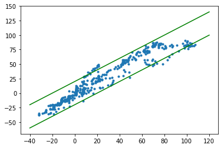

# 基于深度模型与物理模型的临近车道线以及车辆偏移检测

2017 年第九届中国只能车未来挑战赛 CarGO 代表队作品。基于 SegNet 车道线检测结果，进行二值化，根据物理模型继续优化得到。

## 安装

```bash
cd $ROOT_DIR

git clone https://github.com/alexgkendall/caffe-segnet
git clone https://github.com/alexgkendall/SegNet-Tutorial
git clone https://github.com/huboqiang/CargoKeepLane

cd ./CargoKeepLane
conda env create -f=environment_py2.yml --name py2 --debug -v -v

cd ../caffe-segnet
sudo apt-get update && apt-get install -y --no-install-recommends \              
        build-essential \
        cmake \
        git \
        wget \
        libatlas-base-dev \
        libboost-all-dev \
        libgflags-dev \
        libgoogle-glog-dev \
        libhdf5-serial-dev \
        libleveldb-dev \
        liblmdb-dev \
        libopencv-dev \
        libprotobuf-dev \
        libsnappy-dev \
        protobuf-compiler \
        python-dev \
        python-numpy \
        python-pip \
        python-scipy && \
    rm -rf /var/lib/apt/lists/*

pip install Cython>=0.19.2                                                                  
        numpy>=1.7.1  \
        scipy>=0.13.2  \
        scikit-image>=0.9.3  \
        matplotlib>=1.3.1  \
        ipython>=3.0.0  \
        h5py>=2.2.0  \
        leveldb>=0.191  \
        networkx>=1.8.1  \
        nose>=1.3.0  \
        pandas>=0.12.0  \
        python-dateutil>=1.4,<2  \
        protobuf>=2.5.0  \
        python-gflags>=2.0  \
        pyyaml>=3.10  \
        Pillow>=2.3.0  \

make all
make pycaffe
export PYTHONPATH=$ROOT_DIR/caffe-segnet/python:$PYTHONPATH

cd ../SegNet-Tutorial/Example_Models
wget http://mi.eng.cam.ac.uk/~agk34/resources/SegNet/segnet_weights_driving_webdemo.caffemodel

```

## 训练:

参考 `FinalVersion.ipynb` 文件。训练后的预测结果如下：




## 预测：

```bash
cd $ROOT_DIR
python main.py DATASET/TSD-LKSM/TSD-LKSM-00121 DATASET/TSD-LKSM-Info/TSD-LKSM-00121-Info.xml $ROOT_DIR/SegNet-Tutorial/Example_Models/segnet_model_driving_webdemo.prototxt $ROOT_DIR/SegNet-Tutorial/Example_Models/segnet_weights_driving_webdemo.caffemodel
```
